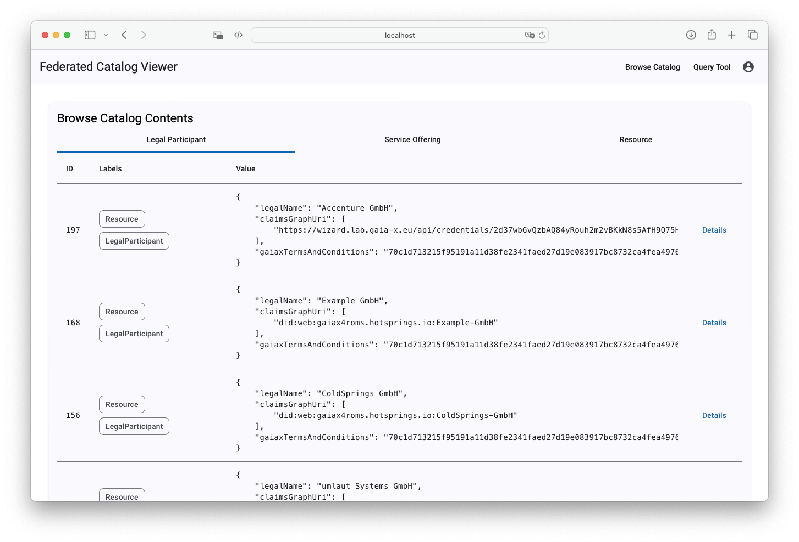

# Federated Catalogue Viewer

User interface to interact with the [XFSC Federated Catalogue](https://gitlab.eclipse.org/eclipse/xfsc/cat/fc-service). Features:

-   Catalog authentication
-   Dedicated listings of assets: LegalParticipant, ServiceOffering, Resource
-   Run custom cipher queries & list output

## Running the app

1. Run `cp example.env .env` and adjust the variables to connect to your catalog instance.
2. Run `docker compose up` to start the app. The UI will be available at `http://localhost:4200/`.

Make sure to add a read-only user to your catalog configuration first. If `DEMO_USERNAME` and `DEMO_USERNAME` are set in your environment, the catalog frontend will automatically authenticate itself. Be aware that this is a frontend component only -- if set, the credentials will be accessible in the browser.

| Environment Variable        | Example Value                                                        |
| --------------------------- | -------------------------------------------------------------------- |
| `FC_QUERY_URL`              | `http://localhost:8081/query`                                        |
| `FC_KEYCLOAK_AUTH_URL`      | `http://key-server:8080/realms/gaia-x/protocol/openid-connect/token` |
| `FC_KEYCLOAK_CLIENT_SCOPE`  | `gaia-x`                                                             |
| `FC_KEYCLOAK_CLIENT_ID`     | `federated-catalogue`                                                |
| `FC_KEYCLOAK_CLIENT_SECRET` | `keycloak-secret`                                                    |
| `DEMO_USERNAME`             | `demo`                                                               |
| `DEMO_PASSWORD`             | `demo`                                                               |

## Development server

Run `npm run start` for a dev server. Navigate to `http://localhost:4200/`. The application will automatically reload if you change any of the source files.

## Build

### Local Build

Run `npm run build` to build the project. The build artifacts will be stored in the `dist/` directory.

### Docker Build

Run `docker build .` to build the project using Docker.
